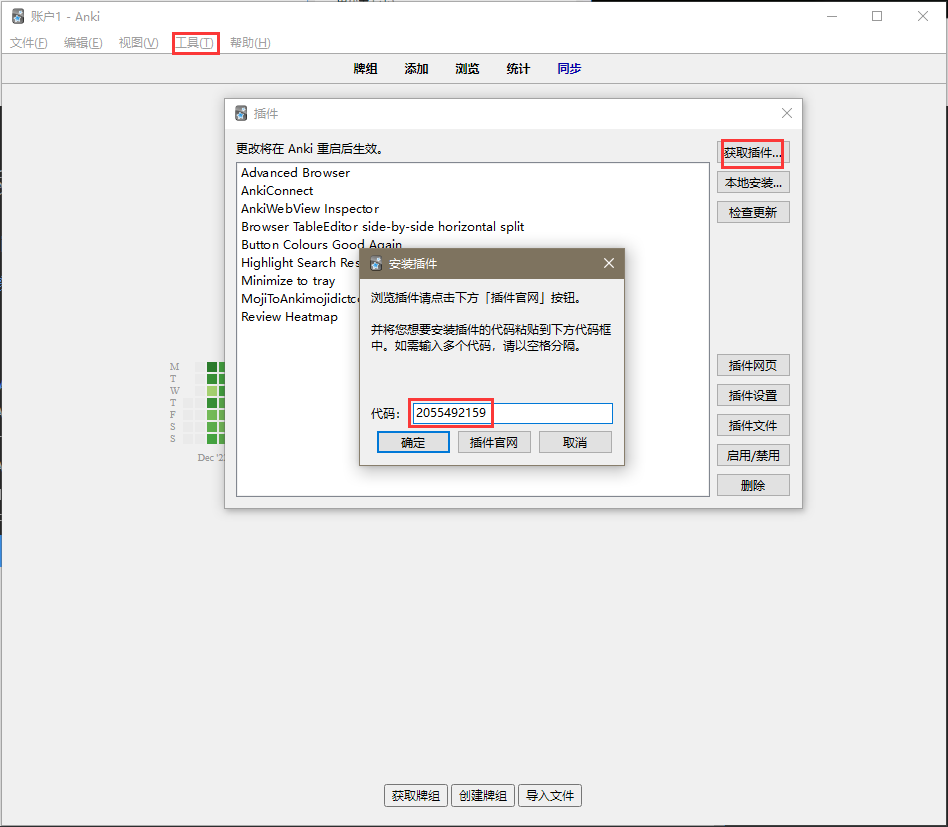
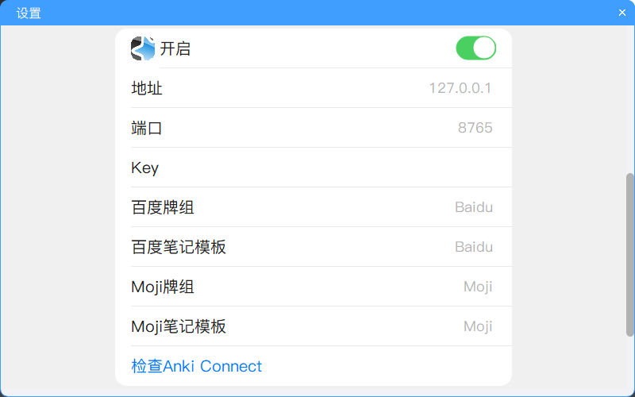
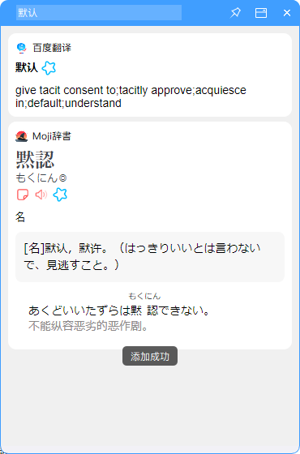

# Anki自动制卡

## 什么是Anki

[Anki是什么，该怎么用？](https://zhuanlan.zhihu.com/p/21338255)

## 步骤

1. 安装插件 [AnkiConnect](https://ankiweb.net/shared/info/2055492159) :
    - 打开Anki->工具->插件->获取插件
    - 输入代码: 2055492159
      
      
    - 重启Anki
2. 将单词添加到Anki时需保持Anki在运行, 可安装插件 [Minimize to tray](https://ankiweb.net/shared/info/85158043) 使Anki可以后台托盘(插件安装步骤同上, 代码: 85158043)
3. 右键程序托盘图标点击设置打开设置界面, 开启Anki

   
4. 查词, 点击按钮即可将单词添加到Anki
   
   

## 注

- 目前仅支持有道词典英译中的单词(不包括句子和中译英等)以及MOJI辞書的词添加到Anki
- 请不要修改或删除生成的模板的字段与值，可以修改模板的样式与排版，可以增加模板字段
- 笔记模板若同名模板已存在将不会覆盖, 请输入未使用的模板名称(除非↓)
- MOJI辞書的Anki模板为基于插件 [MojiToAnki(导入mojidict.com收藏的单词)](https://ankiweb.net/shared/info/131403862) (2023-01-30)的模板进行部分修改的结果, 可结合使用
