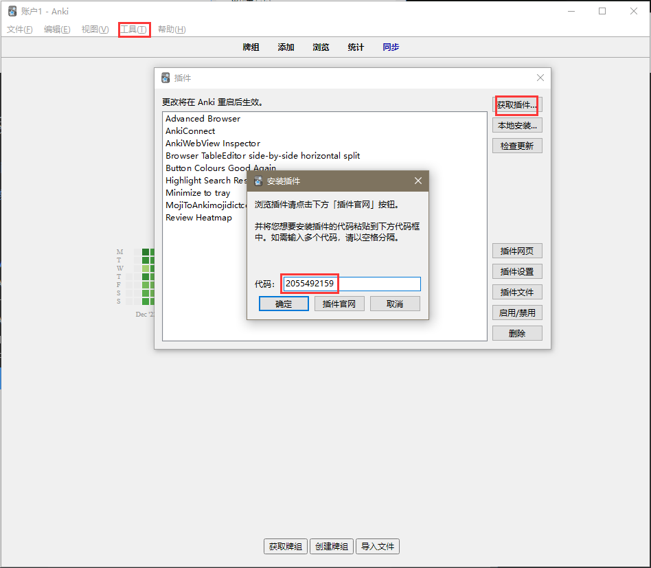
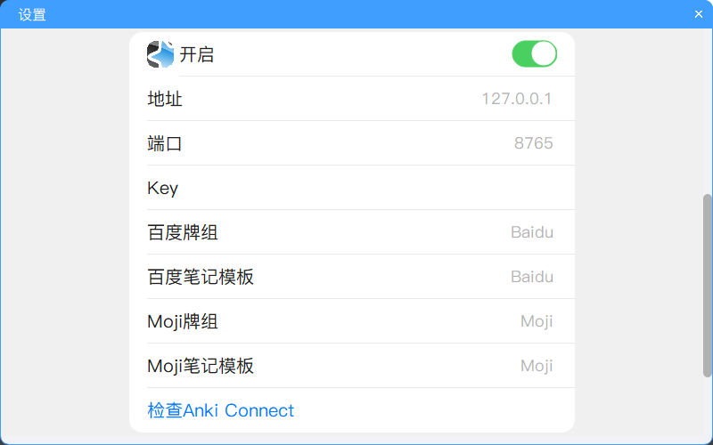
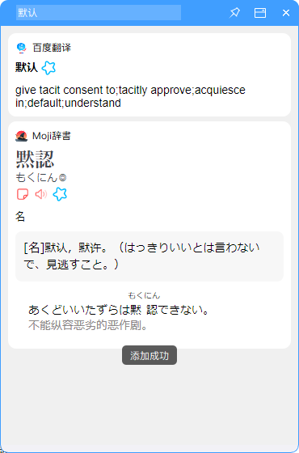

基于PyQt5的Windows桌面划词翻译/查词程序, 支持百度翻译和Moji辞書, 支持将单词添加到Anki

## 翻译/查词

- 鼠标双击/拖动选择文本, 按快捷键(默认`Ctrl+Alt+Z`)进行翻译/查词
- 或者在输入框中输入文本, 按下回车键进行翻译/查词


## Anki自动制卡

### 什么是Anki

[Anki是什么，该怎么用？](https://zhuanlan.zhihu.com/p/21338255)

### 步骤

1. 安装插件 [AnkiConnect](https://ankiweb.net/shared/info/2055492159) :
    - 打开Anki->工具->插件->获取插件
    - 输入代码: 2055492159
      
      
    - 重启Anki
2. 将单词添加到Anki时需保持Anki在运行, 可安装插件 [Minimize to tray](https://ankiweb.net/shared/info/85158043) 使Anki可以后台托盘(插件安装步骤同上, 代码: 85158043)
3. 右键程序托盘图标点击设置打开设置界面, 开启Anki

   
4. 查词, 点击按钮即可将单词添加到Anki
   
   

### 注

- 目前百度翻译仅支持将英译中的单词添加到Anki(不包括句子和中译英等)
- 笔记模板若同名模板已存在将不会覆盖, 请输入未使用的模板名称(除非↓)
- Moji辞書的Anki模板与插件 [MojiToAnki(导入mojidict.com收藏的单词)](https://ankiweb.net/shared/info/131403862) (2022-12-30)一致, 可结合使用

## Bugs

- 百度的发音绝大多数时候会获取失败
- 启动后第一次翻译会有卡顿现象
- 在部分软件使用（如IDEA）会因快捷键冲突而产生问题

---

打包成exe命令:

```
pyinstaller -i "assets\翻译.ico" -n "siho-dict" --add-data "assets;assets" --clean -y -w -F -D "entry.py"
```