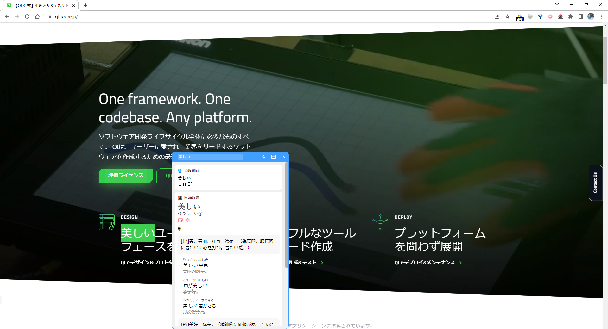

基于PyQt5的Windows桌面划词翻译程序，目前仅支持百度翻译

## 使用

鼠标双击/拖动选择文本，按快捷键(默认`Ctrl+Alt+Z`)进行翻译


## TODO:

- 添加Moji辞典
- 接入Anki

## Bugs

- 启动过程中会有卡顿现象
- 在部分软件使用（如IDEA）会因快捷键冲突而产生问题，如在IDEA可以先自行`Ctrl+C`复制需要翻译的文本，再按快捷键即可翻译。
- 不支持多屏幕

## 参考

- [【Python】读取windows代理信息](https://www.cnblogs.com/wuruiyang/p/15928700.html)
- [python打包exe开机自动启动的实例(windows)](http://www.qb5200.com/article/373470.html)
- [如何在 pyqt 中自定义无边框窗口](https://www.cnblogs.com/zhiyiYo/p/14659981.html)

---

打包成exe命令:

```
pyinstaller -i "assets\翻译.ico" -n "siho-dict" --add-data "assets;assets" --clean -y -w -F -D "entry.py"
```