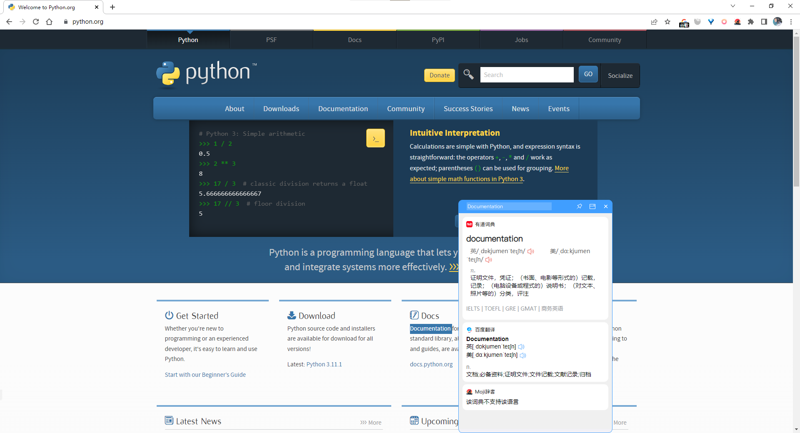

<p align="center">
  
</p>

---

<p align="center">
  基于PyQt5的Windows桌面划词翻译/查词工具
</p>
<p align="center">
    <a style="text-decoration:none" href="https://github.com/shi-hou/siho-dict/releases">
        
    </a>
    <a style="text-decoration:none">
        
    </a>
    <a style="text-decoration:none">
        
    </a>
</p>



## 功能

- 支持划词翻译、输入翻译
- 支持有道词典、百度翻译和Moji辞書
- 支持将单词添加到Anki

## 快速开始

```
git clone git@github.com:shi-hou/siho-dict.git
pip install -r requirements.txt
python entry.py
```

## 安装

前往 [release](https://github.com/shi-hou/siho-dict/releases) 下载最新版本的程序压缩包，解压运行siho-dict.exe即可。

或者自行将代码进行打包:

```
pyinstaller -i "assets\icon\logo-icon.ico" -n "siho-dict" --add-data "assets;assets" --clean -y -w -F -D "entry.py"
```

## 使用

### 翻译/查词

- 鼠标双击/拖动选择文本, 按快捷键(默认`Ctrl+Alt+Z`)进行翻译/查词
- 或者在输入框中输入文本, 按下回车键进行翻译/查词

### 将单词添加到Anki

- [Anki自动制卡](docs/Anki自动制卡.md)

## TODO

- 重置设置管理和设置界面
- 悬浮图标翻译 
- 词典顺序设置
- 暗黑模式
- 主题色设置
- 输入框Suggest
- 历史记录
- 更多词典(必应词典、谷歌翻译...)
- ...