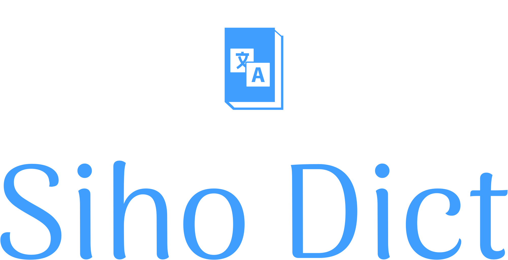
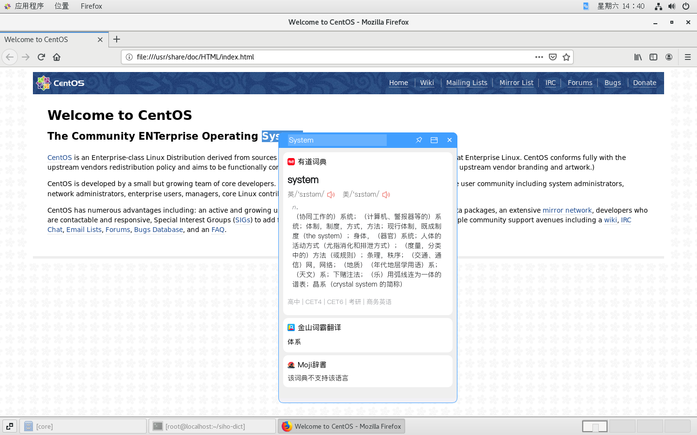

<p align="center">
  
</p>

---

<p align="center">
  基于PyQt5的桌面划词翻译/查词工具
</p>
<p align="center">
    <a style="text-decoration:none" href="https://github.com/shi-hou/siho-dict/releases">
        
    </a>
    <a style="text-decoration:none">
        
    </a>
    <a style="text-decoration:none">
        
    </a>
</p>

- On Windows11:

- On CentOS7:



## Features

- 支持划词翻译、输入翻译
- 支持Windows和Linux(X11)操作系统
- 支持有道词典(中英)、百度翻译、谷歌翻译、金山词霸翻译、福昕翻译、沪江小D词典(日语)、和Moji辞書
- 支持翻译语言: 英语、日语、中文
- 支持将单词添加到Anki

## 快速开始

```
git clone git@github.com:shi-hou/siho-dict.git
pip install -r requirements.txt
python entry.py
```

## 安装

前往 [release](https://github.com/shi-hou/siho-dict/releases) 下载最新版本的程序压缩包，解压运行siho-dict.exe即可。

或者自行将代码进行打包:

```
# install and upgrade pip
pip install pyinstaller --upgrade

# on Windows: 
pyinstaller -i "assets\icon\logo-icon.ico" -n "siho-dict" --add-data "assets;assets" --clean -y -w -F -D "entry.py"

# on Linux: 
pyinstaller -i "assets\icon\logo-icon.ico" -n "siho-dict" --add-data "assets:assets" --clean -y -w -F -D "entry.py"
```

## 使用

### 翻译/查词

- 鼠标双击/拖动选择文本, 按快捷键(默认`Ctrl+Alt+Z`)进行翻译/查词
- 或者在输入框中输入文本, 按下回车键进行翻译/查词

### 将单词添加到Anki

- [Anki自动制卡](docs/Anki自动制卡.md)

## TODO

- 重置设置管理和设置界面
- 悬浮图标翻译
- 词典顺序设置
- 暗黑模式
- 主题色设置
- 输入框Suggest
- 历史记录
- 更多词典(必应词典、谷歌翻译...)
- ...

## LICENSE

```
MIT License

Copyright (c) 2023 Shihou Kou

Permission is hereby granted, free of charge, to any person obtaining a copy
of this software and associated documentation files (the "Software"), to deal
in the Software without restriction, including without limitation the rights
to use, copy, modify, merge, publish, distribute, sublicense, and/or sell
copies of the Software, and to permit persons to whom the Software is
furnished to do so, subject to the following conditions:

The above copyright notice and this permission notice shall be included in all
copies or substantial portions of the Software.

THE SOFTWARE IS PROVIDED "AS IS", WITHOUT WARRANTY OF ANY KIND, EXPRESS OR
IMPLIED, INCLUDING BUT NOT LIMITED TO THE WARRANTIES OF MERCHANTABILITY,
FITNESS FOR A PARTICULAR PURPOSE AND NONINFRINGEMENT. IN NO EVENT SHALL THE
AUTHORS OR COPYRIGHT HOLDERS BE LIABLE FOR ANY CLAIM, DAMAGES OR OTHER
LIABILITY, WHETHER IN AN ACTION OF CONTRACT, TORT OR OTHERWISE, ARISING FROM,
OUT OF OR IN CONNECTION WITH THE SOFTWARE OR THE USE OR OTHER DEALINGS IN THE
SOFTWARE.
```